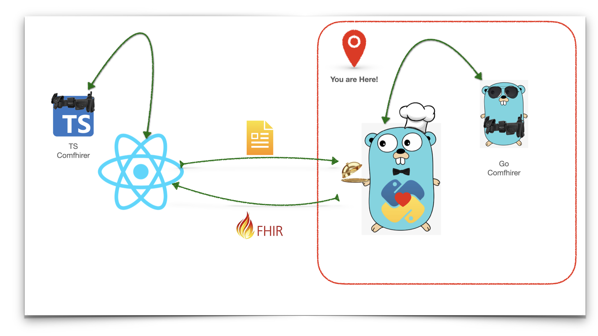

# Comfhirer Server

Comfhirer Server project expose a REST endpoint which accepts a **PDF** file, and returns the corresponding **Fhir Bundle**.
It is consist of two GO modules and one embedded Python module.
## Server
The server module, withholds an http server which after receiving a PDF file makes two internal calls.

First it sends the PDF file to an embedded python module called **_pdf_reader_**. pdf_reader scrapes the PDF file, and
extracts important information, it creates a flat json result.

The flat result goes to the second call, **comfhirer** module, which is a compiler that converts the flat json to a 
**Fhir bundle**.

## Comfhirer
Comfhirer is an high level compiler which converts a flat json to a Fhir bundle. Like all the other compilers it has its
own syntactical rules and regulations as input and it follows Fhir protocol rules to generate the output. To read more 
about Comfhirer please check out its <a href="https://github.com/rzeAkbari/comfhirer-server/tree/main/comfhirer">project</a>.
## Docker
The project comes with a Dockerfile. Simply build and run it from **server** directory.
- docker build . -t comfhirer-server
- docker run -p 5500:5500 comfhirer-server

The default port is set to **5500**, but it is customisable using **_PORT_** environment variable.

## Development
This repository contains two Go modules
- server
- comfhirer: a go module used independently in the **server** project.
### Server
You need to export two environment variables
- **PKG_CONFIG_PATH**: path to python _**pkgconfig**_ folder. This folder must contain _**python.pc**_ file as a
requisite of **_<a href="https://github.com/DataDog/go-python3">datadog go-python3</a>_** library. In case _pkgcongi_
does not contain the _python.pc_ file, you may need to install **_python-dev_** module.
  - **MAC**: /Library/Frameworks/Python.framework/Versions/3.7/lib/pkgconfig/
  - **Linux**: probably under /usr/lib/x86_64-linux-gnu/pkgconfig or /usr/lib/pkgconfig or /usr/local/lib/pkgconfig
- **DIRECTORY**: path to server folder, as an example in Linux, _/home/my-user/some-folder/comfhirer-server/server_

The starting point of the project is the **main.go** file under **_server/cmd/main/main.go_**. Simply run:
- go run main.go

### Test
Both go modules are written in TDD. Either from **server** or **comfhirer** directory you can run go test command. In 
case of _server_ tests there is the need to export two aforementioned environment variables, **PKG_CONFIG_PATH** and 
**DIRECTORY**.
- go run test ./... 
